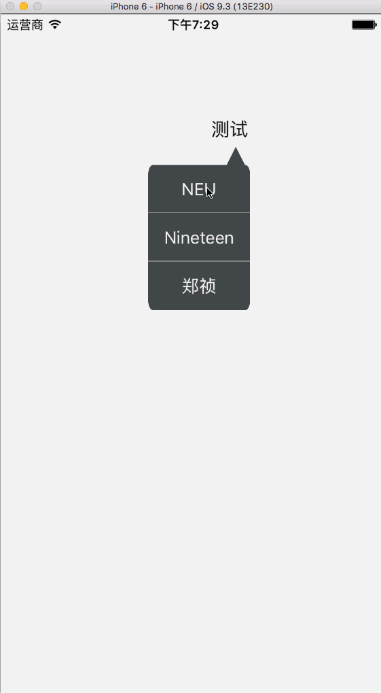

# NTPopUpSelectorView
#### 这是一个弹出对话框式的View


- 具体用法如下：

```objc

    //1、初始化
    NTPopUpSelectorView *selectorView = [NTPopUpSelectorView popUpSelectorViewWithbubbleFrame:CGRectMake(100, 100, 100, 200) clickOption:^(NSIndexPath *indexPath, NTPopUpSelectorView *popUpSelectorView) { // 这里的frame为显示的气泡的frame
    if (indexPath.row == 0) {
        NSLog(@"1");
        [popUpSelectorView removeFromSuperViewWithAnimation];
    } else if (indexPath.row == 1) {
        NSLog(@"2");
    } else if (indexPath.row == 2) {
        NSLog(@"3");
    }
    } clickMask:^(NTPopUpSelectorView *popUpSelectorView){
    [popUpSelectorView removeFromSuperViewWithAnimation];
    }];

    // 2、添加数据
    [selectorView addOptionWihtText:@"NEU"];
    [selectorView addOptionWihtText:@"Nineteen"];
    [selectorView addOptionWihtText:@"郑祯"];

    // 3、显示
    [view showSelectorViewWithAnimationInView:self.view frame:self.view.bounds];// 这里的frame为整个控件的frame
    
```

- 示意动图


